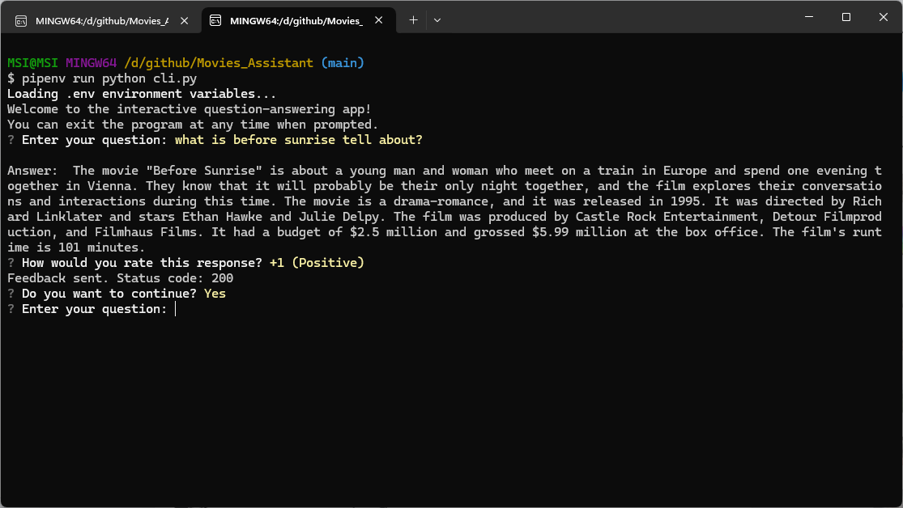
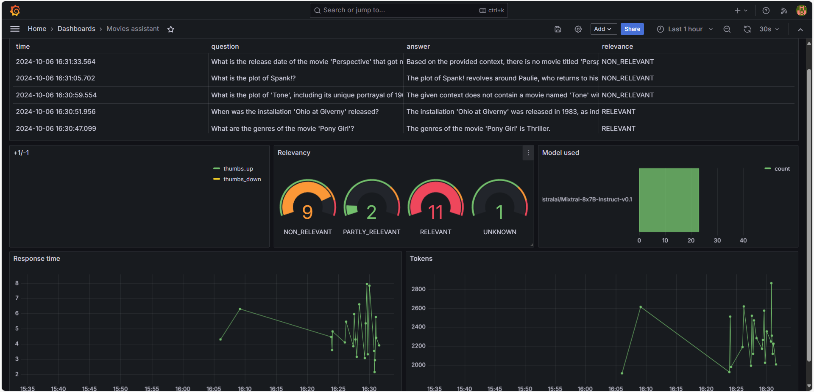

# Movies Assistant

<p align="center">
  
</p>

Keeping up with movie recommendations can be overwhelming, especially with so many options available. Finding something tailored to your taste isn't always easy, and movie critics or friends aren't always around for advice.

The Movies Assistant offers a conversational AI that helps users discover films based on their preferences, providing personalized suggestions to make movie nights more enjoyable.

This project was implemented for [LLM Zoomcamp](https://github.com/DataTalksClub/llm-zoomcamp) - a free course about LLMs and RAG.

## Table of Contents

- [Movies Assistant](#movies-assistant)
- [Project Overview](#project-overview)
- [Dataset](#dataset)
- [Technologies](#technologies)
- [Setup](#setup)
- [Running the Application](#running-the-application)
  - [Database Configuration](#database-configuration)
  - [Running with Docker-Compose](#running-with-docker-compose)
  - [Running Locally](#running-locally)
  - [Running with Docker (Without Compose)](#running-with-docker-without-compose)
- [Using the Application](#using-the-application)
  - [CLI](#cli)
  - [Using Requests](#using-requests)
  - [CURL](#curl)
- [Code](#code)
  - [Interface](#interface)
  - [Ingestion](#ingestion)
- [Experiments](#experiments)
  - [Retrieval Evaluation](#retrieval-evaluation)
- [Monitoring](#monitoring)
  - [Dashboards](#dashboards)
- [Acknowledgements](#acknowledgements)


## Project Overview

The Movies Assistant is a RAG (Retrieval-Augmented Generation) application designed to assist users in navigating and exploring the world of movies with ease.

The main use cases include:

1. **Answer Movie-Related Queries**: Responding to specific questions about movies, actors, directors, or production details.
2. **Give Movie Recommendations**: Offering personalized movie suggestions based on user preferences like genre, mood, or popularity.
3. **Summarize Movie Plots**: Providing concise summaries of movie plots to help users decide what to watch.
4. **Generate Movie Reviews**: Creating movie reviews by analyzing information and providing opinions based on various factors.
5. **Compare Movies**: Helping users compare different movies based on aspects such as ratings, genre, or popularity.
6. **Provide Actor/Director Filmography**: Listing movies by a particular actor or director for users looking to explore their works.
7. **Sentiment Analysis of Movie Reviews**: Analyzing and summarizing the general sentiment of reviews for a specific movie.
8. **Conversational Interaction**: Enabling users to find relevant movie information and suggestions effortlessly through natural, conversational queries, without needing to search through various databases or platforms.

## Dataset

The dataset used for this project is the [Movies Daily Update Dataset](https://www.kaggle.com/datasets/akshaypawar7/millions-of-movies), sourced from Kaggle. The raw dataset consists of approximately 720,000 movies, collected from the TMDB dataset.

After a thorough process of cleaning and filtering, the following key attributes were retained to focus on relevant movie information:

- **id**: Unique identifier for each movie
- **title**: Movie title
- **genres**: Genres associated with the movie
- **original_language**: Language in which the movie was originally produced
- **overview**: Brief description of the movie's plot
- **popularity**: Popularity score
- **production_companies**: Studios or companies involved in production
- **release_date**: Date when the movie was released
- **budget**: Estimated production budget
- **revenue**: Total revenue generated by the movie
- **runtime**: Length of the movie in minutes
- **status**: Release status (e.g., Released, Planned, ...)
- **tagline**: Movie's tagline or slogan
- **vote_average**: Average user rating
- **vote_count**: Total number of user ratings
- **credits**: Information about the cast and crew
- **keywords**: Key terms associated with the movie

This curated dataset provides a structured foundation for the project, enabling better recommendations and analysis.

Since the original dataset is quite large (over 300 MB), I couldn't upload it to GitHub. Instead, I've created a sample with 200 movies for retrieval evaluation.

No worries though, you can download the full dataset from the Kaggle link provided. After unzipping the file, rename it to `movies.csv`, and you're all set.

## Technologies

- Python 3.11
- Docker and Docker Compose for containerization
- [Minsearch](https://github.com/alexeygrigorev/minsearch) and Elasticsearch for full-text search
- Flask as the API interface
- Grafana for monitoring and PostgreSQL as the backend for it
- HuggingFace models as an LLM

## Setup

To get started, you’ll need to provide your Hugging Face API key:

1. Install `direnv`.
2. Copy the `.envrc_template` file to a new `.envrc` file and add your API key inside.
3. Run `direnv allow` to load the API key into your environment.

For managing dependencies, we use `pipenv`. To install it, run:

```bash
pip install pipenv
```

Once `pipenv` is installed, you can install the app dependencies by running:

```bash
pipenv install --dev
```

## Running the application

### Database configuration

Before the application starts for the first time, the database
needs to be initialized.

First, run `postgres` and `elasticsearch`:

```bash
docker compose up postgres elasticsearch
```

Then run the [`db_prep.py`](movies_assistant/db_prep.py) script:

```bash
pipenv shell

cd movies_assistant

export POSTGRES_HOST=localhost
python db_prep.py
```

To check if an index exists in Elasticsearch, you can use the following command:

```bash
curl -X HEAD "localhost:9200/movies"
```

To check the content of the database, use `pgcli` (already
installed with pipenv):

```bash
pipenv run pgcli -h localhost -U admin -d movies_assistant -W
```

You can view the schema using the `\d` command:

```sql
\d conversations;
```

And select from this table:

```sql
select * from conversations;
```


### Running with Docker-Compose

The easiest way to run the application is with `docker compose`:

```bash
docker compose up
```

### Running locally

If you want to run the application locally,
start only Postres and Grafana:

```bash
docker compose up postgres elasticsearch grafana
```

If you previously started all applications with
`docker compose up`, you need to stop the `app`:

```bash
docker compose stop app
```

Now run the app on your host machine:

```bash
pipenv shell

cd movies_assistant

export POSTGRES_HOST=localhost
python app.py
```


### Running with Docker (without compose)

Sometimes you might want to run the application in
Docker without Docker Compose, e.g., for debugging purposes.

First, prepare the environment by running Docker Compose
as in the previous section.

Next, build the image:

```bash
docker build -t movies-assistant .
```

And run it:

```bash
docker run -it --rm \
    --network="movies-assistant_default" \
    --env-file=".env" \
    -e HUGGINGFACE_TOKEN=${HUGGINGFACE_TOKEN} \
    -e ELASTIC_URL=${ELASTIC_URL} \
    -e DATA_PATH="data/movies.csv" \
    -p 5000:5000 \
    movies-assistant
```

## Using the application

When the application is running, we can start using it.

### CLI

We built an interactive CLI application using
[questionary](https://questionary.readthedocs.io/en/stable/).

To start it, run:

```bash
pipenv run python cli.py
```

CLI demo:

<p align="center">
  
</p>


You can also make it randomly select a question from
[our ground truth dataset](data/ground-truth-retrieval.csv):

```bash
pipenv run python cli.py --random
```

### Using `requests`

When the application is running, you can use
[requests](https://requests.readthedocs.io/en/latest/)
to send questions—use [test.py](test.py) for testing it:

```bash
pipenv run python test.py
```
It will pick a random question from the ground truth dataset
and send it to the app.

### CURL

You can also use `curl` for interacting with the API:

```bash
URL=http://localhost:5000
QUESTION="Before Sunrise actors"
DATA='{
    "question": "'${QUESTION}'"
}'

curl -X POST \
    -H "Content-Type: application/json" \
    -d "${DATA}" \
    ${URL}/question
```

You will see something like the following in the response:

```json
{
  "answer":" The actors in the 1995 movie \"Before Sunrise\" are Ethan Hawke and Julie Delpy.",
  "conversation_id":"c51e8f4d-679c-4fcc-909e-f810f9f677aa",
  "question":"Before Sunrise actors"
}
```

Sending feedback:

```bash
ID=c51e8f4d-679c-4fcc-909e-f810f9f677aa
URL=http://localhost:5000
FEEDBACK_DATA='{
    "conversation_id": "'${ID}'",
    "feedback": 1
}'

curl -X POST \
    -H "Content-Type: application/json" \
    -d "${FEEDBACK_DATA}" \
    ${URL}/feedback
```

After sending it, you'll receive the acknowledgement:

```json
{
  "message":"Feedback received for conversation c51e8f4d-679c-4fcc-909e-f810f9f677aa: 1"
}
```

## Code

The code for the application is in the [`movies_assistant`](movies_assistant/) folder:

- [`app.py`](movies_assistant/app.py) - the Flask API, the main entrypoint to the application
- [`rag.py`](movies_assistant/rag.py) - the main RAG logic for building the retrieving the data and building the prompt
- [`db.py`](movies_assistant/db.py) - the logic for logging the requests and responses to postgres
- [`db_prep.py`](movies_assistant/db_prep.py) - the script for initializing the database, creating an index in Elasticsearch

We also have some code in the project root directory:

- [`test.py`](test.py) - select a random question for testing
- [`cli.py`](cli.py) - interactive CLI for the APP

### Interface

We use Flask for serving the application as an API.

Refer to the ["Using the Application" section](#using-the-application)
for examples on how to interact with the application.

### Ingestion

Problem: The large dataset initially caused slow ingestion.

Tests with MinSearch and default Elasticsearch indexing took too long.

Using Elasticsearch's bulk indexing significantly improved speed. Check [`db_prep.py`](movies_assistant/db_prep.py) for details.

Thanks to peer reviewers for suggesting tools to optimize this process.

## Experiments

For experiments, we use Jupyter notebook.
They are in the [`notebook`](notebook/) folder.

To start Jupyter, run:

```bash
cd notebook
pipenv run jupyter notebook
```

We have the following notebook:

- [`rag_es.ipynb`](notebook/rag_es.ipynb): The RAG flow using ElasticSearch.
- [`rag_minsearch.ipynb`](notebook/rag_minsearch.ipynb): The RAG flow using minsearch.
- [`evaluation_data_generation.ipynb`](notebook/evaluation_data_generation.ipynb): Generating the ground truth dataset for retrieval evaluation.
- [`retrieval_evaluation.ipynb`](notebook\retrieval_evaluation.ipynb): Evaluating the retrieval system.
- Some data cleaning, preprocessing phase.


### Retrieval evaluation

The basic approach - using `ElasticSearch` without any boosting - gave the following metrics:

- Hit rate: 69%
- MRR: 64%

I'm tunning boost with hyperopt but the result doesn't improve, check in [retrieval_evaluation.ipynb](notebook\retrieval_evaluation.ipynb)
<!-- The improved version (with tuned boosting):

- Hit rate: 
- MRR: 

The best boosting parameters: xxx

```python
boost = {
    'exercise_name': 2.11,
    'type_of_activity': 1.46,
    'type_of_equipment': 0.65,
    'body_part': 2.65,
    'type': 1.31,
    'muscle_groups_activated': 2.54,
    'instructions': 0.74
}
``` -->

## Monitoring

We use Grafana for monitoring the application. 

It's accessible at [localhost:3000](http://localhost:3000):

- Login: "admin"
- Password: "admin"

### Dashboards

<p align="center">
  
</p>

The monitoring dashboard contains several panels:

1. **Last 5 Conversations (Table):** Displays a table showing the five most recent conversations, including details such as the question, answer, relevance, and timestamp. This panel helps monitor recent interactions with users.
2. **+1/-1 (Pie Chart):** A pie chart that visualizes the feedback from users, showing the count of positive (thumbs up) and negative (thumbs down) feedback received. This panel helps track user satisfaction.
3. **Relevancy (Gauge):** A gauge chart representing the relevance of the responses provided during conversations. The chart categorizes relevance and indicates thresholds using different colors to highlight varying levels of response quality.
5. **Tokens (Time Series):** Another time series chart that tracks the number of tokens used in conversations over time. This helps to understand the usage patterns and the volume of data processed.
6. **Model Used (Bar Chart):** A bar chart displaying the count of conversations based on the different models used. This panel provides insights into which AI models are most frequently used.
7. **Response Time (Time Series):** A time series chart showing the response time of conversations over time. This panel is useful for identifying performance issues and ensuring the system's responsiveness.

## Acknowledgements

I would like to thank Alex, the LLM-Zoomcamp, and all the members of the 2024 cohort for guidance and sharing  throughout the development of this project. The knowledge I gained from the course was essential to completing this work.

Thank you all from VietNam!!!